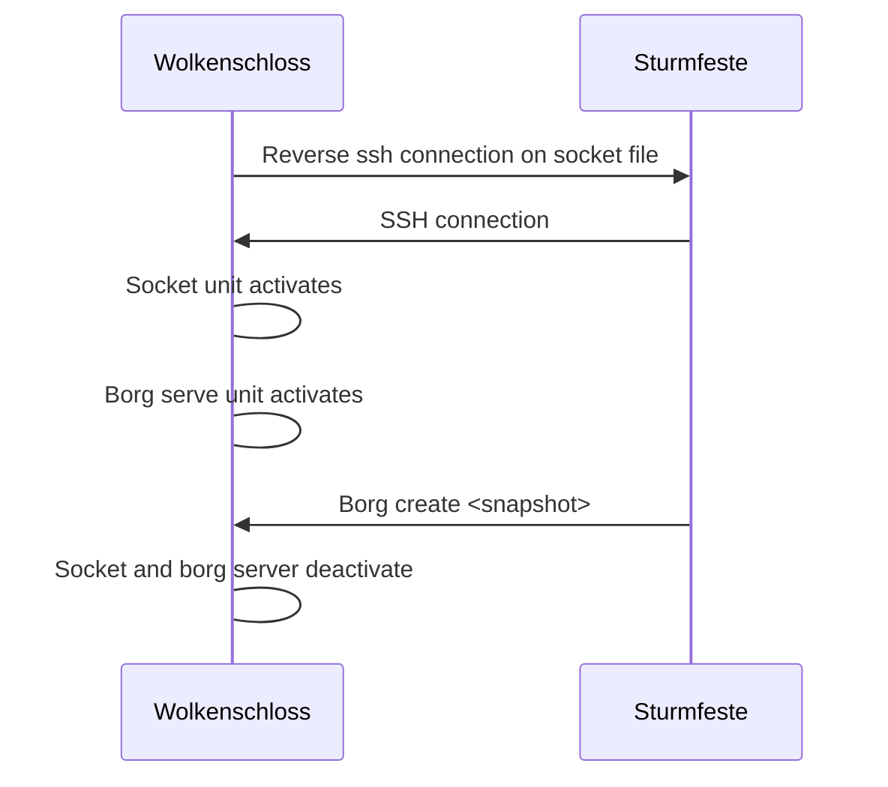

# Backup Process

Self hosting introduces the responsibility of making your own backups. Otherwise you will potentially lose your data, if
your hardware fails, you get hacked or you just typed the wrong commands.

For this case, we provide the Sturmfeste Backup server configuration. Those servers will connect to the Wolkenschloss server regularly and save the data.
Because the Wolkenschloss server has a lot of software on it, has a complex configuration, and hosts stuff publicly, its attack surface is large. If an attacker could compromise the Wolkenschloss server, they could potentially access the backup data or the job configuration and change/delete it. Thats why Sturmfeste pulls the data, instead of the Wolkenschloss pushing it.

The pull process using Borg is detailed here: <https://borgbackup.readthedocs.io/en/stable/deployment/pull-backup.html#socat>



## Configuring Backup Clients

### Configuring a Wolkenschloss Host

Use the `wolkenschloss.modules.mixins.borgPullModeBackupClient` mixin to configure a Wolkenschloss host to be backed up by a Sturmfeste backup server.

### Configuring a non-NixOS Backup Client

If you have a non-Wolkenschloss, non-NixOS host that you want to backup with the Sturmfeste backup server,
you need to prepare it for the reverse ssh connection and the borg backup.

```bash
# Add to /etc/ssh/sshd_config.d/reverse-ssh-with-sockets.conf
AllowStreamLocalForwarding yes
StreamLocalBindUnlink yes

# Then
sudo systemctl restart sshd

# Allow user that runs the backups on the client to use borg
sudo apt install borg
echo "myuser ALL=(root:root) NOPASSWD:SETENV: /usr/bin/borg" >> /etc/sudoers

sudo mkdir -p /root/secrets/backup
# Fill the password manually
sudo nano /root/secrets/backup/password
```

To manually test the reverse ssh and borg connection, do

```bash
# On the backup server
sudo ssh -vvv \
  -o ExitOnForwardFailure=yes \
  -o StreamLocalBindUnlink=yes \
  -N \
  -R /tmp/borg.sock:/run/remote-backup/borgbackup.sock \
  myuser@myhost

# Test connection to the tunnel on the backup client
socat -t2 - UNIX-CONNECT:/tmp/borg.sock </dev/null
```

### Configuring Backup Servers

This guide assumes you have a NixOS host with the Projekt Wolkenschloss Sturmfeste module enabled (see the [Getting Started Guide](getting-started.md) for more details on how to set up a Sturmfeste backup server).

You can configure backup jobs by adding a nix file to the Sturmfeste configuration.

Assumptions:

- Host has IP 192.168.0.100
- Host has a user `nixos` with sudo privileges
- Host has ssh server running on port 45000
- Host public ssh key is `AAAABBBBCCCC`
- Mass storage is available on the backup server at `/tank/backup`

Create a file `myhost-backup.nix` with the following content:

```nix
{
  config,
  ...
}:

{
  sops.secrets."backup/passwords/myhost" = { };
  # Preconfigure ssh daemon to not prompt for confirmation of the host key
  programs.ssh.knownHosts = {
    "[192.168.0.100]:45000".publicKey =
      "AAAABBBBCCCC";
  };

  wolkenschloss.modules.mixins.borgPullModeBackupServer = {
    jobs = {
      myHostJobName = {
        enable = true;
        borgRepoPath = "/tank/backup/my-host-job-name";
        borgRepoPasswordFile = config.sops.secrets."backup/passwords/myhost".path;
        pathsToBackup = [
          "/var/lib/paperless/export"
          "/some/other/path/that/i/want/to/backup"
        ];
        backupSchedule = "*-*-* 03:00:00";
        backupClient = {
          user = "nixos";
          hostname = "myhost";
          host = "192.168.0.100";
          sshKeyFile = "/etc/ssh/ssh_host_ed25519_key";
          additionalSshArgs = "-p 45000";
        };
      };
    };
  };
}
```

Then, add it to your configuration with `imports = [ ./myhost-backup.nix ];` and apply the configuration.

On the Sturmfeste, your job should now appear when searching with `systemctl list-unit-files | grep -E "borgbackup.*-create\.service"`.

You can start the backup job manually with `sudo systemctl start borgbackup-<jobname>.service` and check the logs with `journalctl -u borgbackup-<jobname>.service`.
