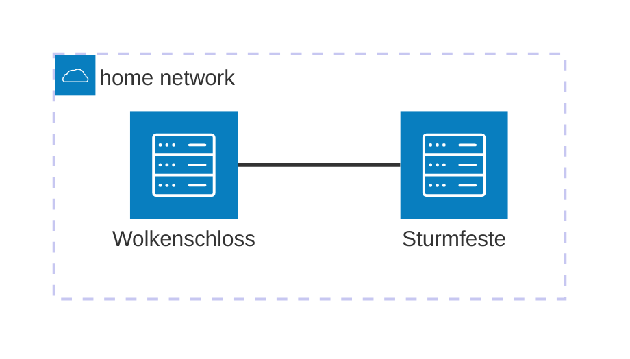

# Getting Started

Projekt Wolkenschloss has two main components: the main server, which is called Wolkenschloss, and the backup server, which is called Sturmfeste.

The Wolkenschloss server is the main server that provides the services you want to use in your personal cloud.
The Sturmfeste server is a backup server that pulls the data from Wolkenschloss and other hosts and stores it in a secure way.

## Creating your own Sturmfeste

Prerequisites:

- A machine to run the Sturmfeste server on with at least 2GB RAM and a 100GB root partition
- Mass storage connected to the machine for storing the backups
- NixOS installed on the machine

Follow the instructions in the [Sturmfeste README](../testing/sturmfeste-test/README.md) to create your own Sturmfeste server.

To configure the actual backup jobs, check out the [backup process documentation](backup-process.md).

## Creating your own Wolkenschloss

Not yet supported. See the [Roadmap](../README.md#roadmap) for more details.
